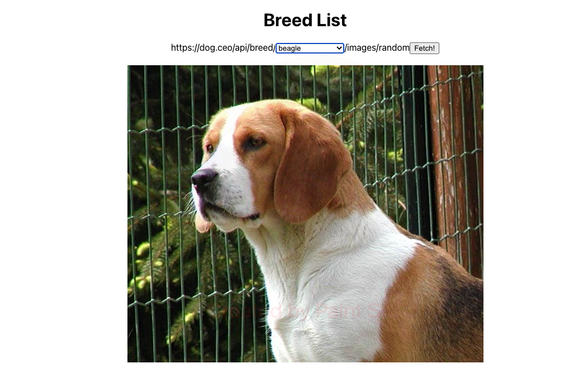

# Dog Picture Finder

### Table of Contents

- [Description](#description)
- [Installation](#installation)
- [Usage](#usage)
- [Screenshot](#screenshot)
- [Teachologies Used](#technologies-used)
- [License](#license)
- [Contact Me](#contact-me)

### Description

Dog Picture Finder app built utilising React front end and fetch data form an API. Users may find random dog pictures by selecting a breed from the dropdown list.

### Installation

```
git clone git@github.com:angelawong3/dog-pic-finder.git
cd dog-pic-finder
npm install
```

### Usage

```
npm run start
```

### Screenshot


User Interface

### Technologies Used

1. React
2. API
3. CSS

### License

[](https://opensource.org/licenses/MIT)

### Contact Me

Please contact me at angelawong3@yahoo.com

---

© 2022 Angela Wong
